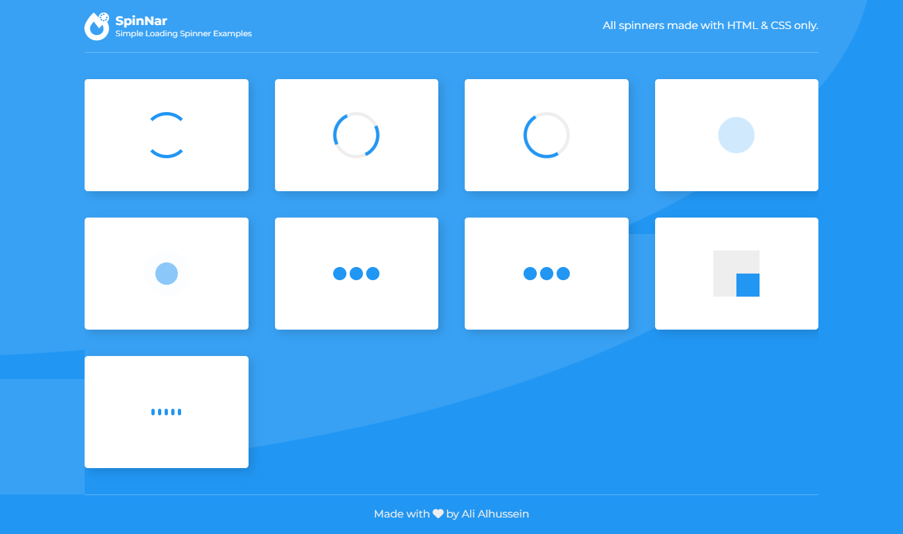

# SpinNar App
This repository is a simple loading spinner Examples application developed using HTML, CSS, and vanilla JavaScript.

The main feature of this application is that all spinners are built using CSS only.

I look forward to your contribution to this application and to adding your own spinners, and this is the main goal of building this application


## Live Previwe
[Github Pages](https://alialhussein.ml/spinnar)



## Usage 
Click on the spinner you want and copy the corresponding HTML and CSS codes

## Contribution
#### Fork this repository and do the following steps and then make a pull request
- Add the data of the spinner to be created into the data.js file located in the path `./js/data.js` in the form of an object as follows:
  ```js
  { // Spinner element
    name: 'YOUR_SPINNER_NAME',
    className: 'CSS_CLASS_NAME_OF_SPINNER_HTML_ELEMENT',
    innerContent: [ // (Optional) css class names of spinner child elements
      {
        className: 'CSS_CLASS_NAME_OF_SPINNER_CHILD_HTML_ELEMENT',
      },
    ],
  },
  ```
- Create a CSS file in the path:  `./css/spinners/your-spinner-name.css` with the same `name` as the spinner you created in the `data.js` file.
- Then import it into the file: `./css/spinners/all.css`

- Add to it the necessary styles to make the spinner work, using the same `className` of the spinner you created in the `data.js` file or any other related selectors (tag-names, pseudo-selectors ..etc) that will work.

## Credits
* Free Google font [Montserrat](https://fonts.google.com/specimen/Montserrat)

